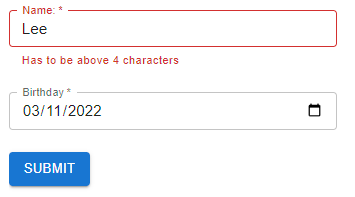

# 🍓 README

[](https://tutim.io)

## **Form infrastructure for product teams**

Headless forms module to create web-app powerful forms in minutes.

[](https://github.com/tutim-io/tutim/blob/main/LICENSE) [](https://github.com/tutim-io/tutim/stargazers) [](https://discord.tutim.io) [](https://docs.tutim.io) [](https://www.producthunt.com/@leetwito)

---

### 🍓 Why Tutim?

Building forms in apps is complicated.

At first, it seems like just throwing a few input fields, but in reality, it's just the beginning.

Tutim gives you your own in-house form builder that's fully integrated with your component library and design system. Everybody on your team can create, edit, and publish forms and surveys in your app regardless of their technical background.

This repo is 100% free, and will always remain. Visit [tutim.io](https://tutim.io) for our pro features.

### ✨ Features

- 🌈 **Headless:** Default design system that can be replaced with yours
- 💅 **Rich form:** Save draft, wizard, conditional branching, and more are available out-of-the-box
- 🚀 **Performant:** Best practices are implemented. Never worry about delays
- 🛠️ **No-Code Builder:** Let PMs and designers create and change forms. Stick with React for styling and embedding
- 👨‍💻 **Built-in Analytics:** Opening rate, drop-offs, conversions. privacy-first `(coming soon)`
- 📦 **Templates:** Onboarding, personal details, feedback from our gallery`(coming soon)`

### 🚀 Getting Started

[**Explore the docs »**](https://docs.tutim.io)

We are excited to launch the complete Tutim API and admin panel.

Create your first form in 2 minutes, by following these steps:

1\. Install tutim React package:

```bash
yarn add @tutim/headless @tutim/fields
```

```bash
npm install @tutim/headless @tutim/fields
```

2\. Create your first form schema with [Tutim Form Builder](https://builder.tutim.io/), or by creating the form JSON schema yourself

3\. Render the form:

```jsx
import { FormProvider } from "@tutim/headless";
import { Form, defaultFields } from "@tutim/fields";

const config = {
  // Use https://builder.tutim.io/ to create and manage rich schemas with no-code
  fields: [
    { key: "firstName", label: "First Name", inputType: "text" },
    { key: "lastName", label: "Last Name", inputType: "text" },
  ],
};

export const SimpleForm = () => {
  return <Form onSubmit={console.log} config={config} />;
};

export const ExampleApp = () => {
  return (
    <div className="App">
      <FormProvider fieldComponents={defaultFields}>
        <SimpleForm />
      </FormProvider>
    </div>
  );
};
```

### ⭐ Example

Play with Tutim and create a form in 2 minutes



Save this JSON file as 'signup-schema.json' (built by [Tutim form builder](https://builder.tutim.io/))

```json
{
  "fields": [
    {
      "key": "email",
      "label": "Email",
      "inputType": "text",
      "isRequired": true,
      "validations": {
        "pattern": {
          "value": "^[\\w-\\.]+@([\\w-]+\\.)+[\\w-]{2,4}$",
          "message": "Must be a valid email"
        }
      }
    },
    { "key": "first_name", "label": "First Name", "inputType": "text" },
    { "key": "last_name", "label": "Last Name", "inputType": "text" }
  ]
}
```

Render and make customizations with React, like using your own design system

```jsx
import { FormProvider } from "@tutim/headless";
import { Form, defaultFields } from "@tutim/fields";
import signupSchema from "./signup-schema.json";

export const SimpleForm = () => {
  return <Form onSubmit={console.log} config={signupSchema} />;
};

export const ExampleApp = () => {
  return (
    <div className="App">
      <FormProvider fieldComponents={defaultFields}>
        <SimpleForm />
      </FormProvider>
    </div>
  );
};
```

Use `useForm` Hook to control forms, all 'react-hook-forms' methods are supported and much more. `FormView` for the UI (based on MUI)

```jsx
import { useForm } from "@tutim/headless";
import { FormView } from "@tutim/fields";
import signupSchema from "./signup-schema.json";

export const ControlledForm = (): JSX.Element => {
  const form = useForm(config);
  return <FormView onSubmit={console.log} form={form} />;
};
```

We also support headless lean solution, bring your own input (we only handle form logic, UI is up to you for maximum flexability)

```jsx
import { useForm } from "@tutim/headless";
import { Field } from "@tutim/types";

export const CustomField: Field = ({ inputProps }) => {
  const { value, onChange } = inputProps;
  const onClick = () => onChange(value + 2);
  return (
    <button type="button" onClick={onClick}>
      Click Me: {value}
    </button>
  );
};

const config = {
  fields: [
    {
      key: "firstName",
      label: "First Name",
      inputType: "text",
      defaultValue: "first",
    },
    { key: "lastName", label: "Last Name", inputType: "text" },
    {
      key: "clicker",
      label: "Click Me",
      inputType: "custom",
      defaultValue: 0,
      Field: CustomField,
    },
  ],
};

export const HeadlessForm = (): JSX.Element => {
  const { fieldsByKey, watch, handleSubmit } = useForm(config);
  const name = watch("firstName");

  return (
    <form onSubmit={handleSubmit(console.log)}>
      {fieldsByKey["firstName"]}
      {name === "first" && fieldsByKey["lastName"]}
      {fieldsByKey["clicker"]}
      <input type="submit" />
    </form>
  );
};
```

Use `FormProvider` to manage all your `fieldComponents`. can use our default fields or use your own

```jsx
import { FormProvider } from "@tutim/headless";
import { defaultFields } from "@tutim/fields";
import { FieldComponents, InputType } from "@tutim/types";
import { SimpleForm } from "./SimpleForm";
import { CustomField } from "./CustomField";

const fieldComponents: FieldComponents = {
  ...defaultFields, // optional built in input fields based on MUI
  [InputType.Text]: ({ inputProps }) => <input {...inputProps} />,
  "custom-field": (fieldProps) => <CustomField {...fieldProps} />,
  // add any type of input and reference it by 'inputType'
};

export const App = (): JSX.Element => {
  return (
    <div className="App">
      <FormProvider fieldComponents={fieldComponents}>
        <SimpleForm />
      </FormProvider>
    </div>
  );
};
```

BYOF - Bring Your Own Field. Use `Field` type to register any type of field. Can be used on `FormProvider` level for global inputs or withing `FieldConfig` for local use cases

```jsx
import { Field, FieldConfig } from "@tutim/types";

export const CustomField: Field = ({ inputProps }) => {
  const { value, onChange } = inputProps;
  const onClick = () => onChange(value + 2);
  return (
    <button type="button" onClick={onClick}>
      Click Me: {value}
    </button>
  );
};

export const customFieldConfig: FieldConfig = {
  key: "clicker",
  label: "Click Me",
  inputType: "custom",
  defaultValue: 0,
  Field: CustomField,
};
```

### 📜 Forms

Tutim provides all forms solutions. Through code or drag & drop interface.

**💌 Inputs**

- [x] All basic (Text, Select, Checkbox, Date...)
- [x] Array & Multi fields
- [x] Nested and deep nested support
- [ ] Rich input library (coming soon)

**📞 Design & Layout**

- [x] Simple form layout (one pager)
- [x] Layout and grouping control
- [ ] Wizard multi steps (coming soon)
- [ ] DnD rich builder

**😊 Portal**

- [x] Simple form builder
- [ ] DnD form builder (coming soon)
- [ ] Templates library (coming soon)
- [ ] Conditional branching

**😊 Cloud**

- [x] Manage and serve schemas (closed-beta, public coming soon)
- [x] Hosted forms (closed-beta, public coming soon)
- [ ] Backend support
- [ ] 3rd Party integrations

### 🤵 Need Help?

We are more than happy to help you.

If you are getting any errors, facing problems, or need a new feature while working on this project -

[Open an issue](https://github.com/tutim-io/tutim/issues/new/choose) or join our [Discord server](https://discord.tutim.io) and ask for help.

### 🔗 Links

- [Home page](https://tutim.io)
- [Builder](https://builder.tutim.io)
- [Discord community](https://discord.tutim.io)
- [Twitter](https://twitter.com/Tutim_io)
- [Contribution Guidelines](https://tutim.io/contribute)
- [Docs](https://docs.tutim.io)
- [Support on Product Hunt (follow, we're launching soon!)](https://www.producthunt.com/@leetwito)

### 💪 By the community, for the community


Powered by [Tutim.io](https://tutim.io)
